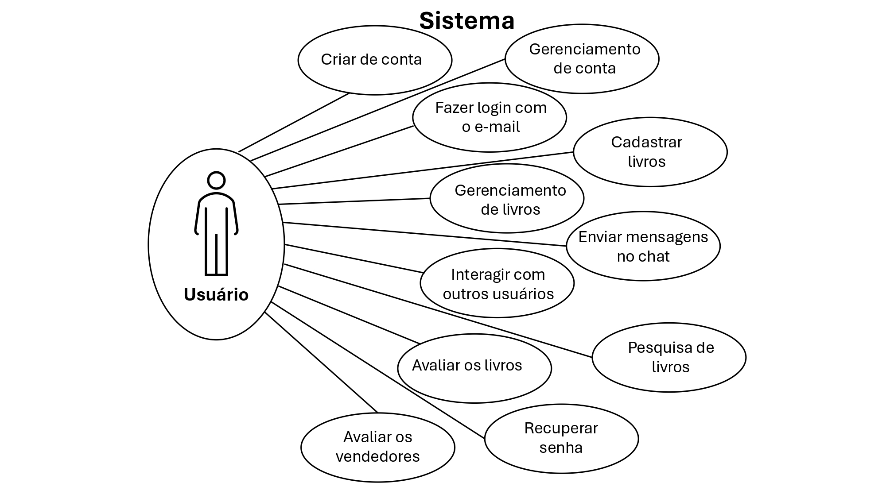

# Especificações do Projeto

## Personas

**Nome:** Laura Martins

**Idade:** 33 anos

**Filiação:** João Martins Oliveira - 12 anos

**Ocupação:** Auxiliar Administrativa 

**Motivações:** Após conseguir uma bolsa para seu filho em uma escola particular, está em busca de livros usados por serem mais baratos.

**Frustrações:** Seu filho acabou de ingressar na nova escola e ainda não possuem contatos com outros pais para conseguirem livros usados.

**Nome:** Julio Pereira

**Idade:** 30 anos

**Filiação:** Alice Pereira - 12 anos

**Ocupação:** Ecologista 

**Motivações:** Engajado nas causas ambientais, acredita que a reutilização de livros contribui com a diminuição de lixo gerado.

**Frustrações:** No colégio em que sua filha estuda não possui uma feira de livros usados.

**Nome:** Claudia Ribeiro

**Idade:** 38 anos

**Filiação:** Beatriz Ribeiro  - 15 anos

**Ocupação:** Advogada 

**Motivações:** Vinda de uma família humilde, busca sempre uma maneira de ajudar os mais necessitados.

**Frustrações:** Possui uma vida muito atarefada com o trabalho e não encontra tempo para se encontrar com outros pais.

**Nome:** Fernando Ferreira

**Idade:** 21 anos

**Ocupação:** Estudante de Engenharia e estagiário. 

**Motivações:** Está em sua primeira graduação e depende de sua bolsa de estágio para se manter. Precisa economizar na compra de livros didáticos e eventualmente vendê-los ao final do semestre para conseguir comprar outros.

**Frustrações:** Dificuldade em encontrar livros didáticos usados em bom estado de conservação.

Enumere e detalhe as personas da sua solução. Para tanto, baseie-se tanto nos documentos disponibilizados na disciplina e/ou nos seguintes links:

## Histórias de Usuários

Com base na análise das personas forma identificadas as seguintes histórias de usuários:

|EU COMO... `PERSONA`| QUERO/PRECISO ... `FUNCIONALIDADE` |PARA ... `MOTIVO/VALOR`                 |
|--------------------|------------------------------------|----------------------------------------|
|Laura Martins / Fernando Ferreira | Encontrar livros de baixo custo | Que o orçamento não ultrapasse o meu limite disponível |
|Julio Pereira | Reutilizar livros escolares| Contribuir com o meio ambiente |
|Claudia Ribeiro | Vender os livros usados a baixo custo | Os pais que não conseguem comprar livros novos |
|Laura Martins / Fernando Ferreira | Vender os livros usados | Conseguir comprar os livros atuais  |
|Laura Martins / Julio Pereira / Fernando Ferreira | Encontrar livros bem conservados | Que o aluno tenha mais qualidade nos estudos |

Apresente aqui as histórias de usuário que são relevantes para o projeto de sua solução. As Histórias de Usuário consistem em uma ferramenta poderosa para a compreensão e elicitação dos requisitos funcionais e não funcionais da sua aplicação. Se possível, agrupe as histórias de usuário por contexto, para facilitar consultas recorrentes à essa parte do documento.

## Requisitos

As tabelas que se seguem apresentam os requisitos funcionais e não funcionais que detalham o escopo do projeto.

### Requisitos Funcionais

|ID    | Descrição do Requisito  | Prioridade |
|------|-----------------------------------------|----|
|RF-001| O sistema deve apresentar, na página principal, a funcionalidade de cadastro de usuários para que esses consigam criar e gerenciar seu perfil | ALTA |
|RF-002| O sistema deve possuir opção de fazer login, sendo o login endereço de e-mail. | ALTA |
|RF-003| O sistema deve permitir que o usuário cadastre e gerencie livros para venda. | ALTA |
|RF-004| O sistema deve oferecer uma funcionalidade de filtro/pesquisa para permitir ao usuário localizar livros por critérios diversos. | ALTA |
|RF-005| O sistema deve ter um chat para conversação em cada anúncio para os usuários interagirem entre si. | ALTA |
|RF-006| O sistema deve permitir que o usuário avalie os livros adquiridos | MÉDIA |
|RF-007| O sistema deve permitir que o usuário avalie o vendedor após uma compra. | MÉDIA |
|RF-008| O sistema deve permitir que o usuário recupere sua senha. | ALTA |

### Requisitos não Funcionais

|ID     | Descrição do Requisito  |Prioridade |
|-------|-------------------------|----|
|RNF-001| O sistema deve ser responsivo | MÉDIA |
|RNF-002| O sistema deve funcionar nas versões recentes dos principais navegadores (Chrome, Firefox, Edge, Safari) |  ALTA |
|RNF-003| O sistema deve ser implantando em nuvem (Heroku, Azure,AWS) | ALTA |
|RNF-004| O sistema deve utilizar boas práticas de acessibilidade |

Com base nas Histórias de Usuário, enumere os requisitos da sua solução. Classifique esses requisitos em dois grupos:

- [Requisitos Funcionais
 (RF)](https://pt.wikipedia.org/wiki/Requisito_funcional):
 correspondem a uma funcionalidade que deve estar presente na
  plataforma (ex: cadastro de usuário).
- [Requisitos Não Funcionais
  (RNF)](https://pt.wikipedia.org/wiki/Requisito_n%C3%A3o_funcional):
  correspondem a uma característica técnica, seja de usabilidade,
  desempenho, confiabilidade, segurança ou outro (ex: suporte a
  dispositivos iOS e Android).
Lembre-se que cada requisito deve corresponder à uma e somente uma
característica alvo da sua solução. Além disso, certifique-se de que
todos os aspectos capturados nas Histórias de Usuário foram cobertos.

## Restrições

O projeto está restrito pelos itens apresentados na tabela a seguir.

|ID| Restrição                                             |
|--|-------------------------------------------------------|
|01| O projeto deverá ser entregue até 23/06/2024 |
|02| O sistema deve ser desenvolvido utilizando a arquitetura MVC|
|03| O sistema deve ser desenvolvido utilizando-se C#|

Enumere as restrições à sua solução. Lembre-se de que as restrições geralmente limitam a solução candidata.

## Diagrama de Casos de Uso

O diagrama de casos de uso é o próximo passo após a elicitação de requisitos, que utiliza um modelo gráfico e uma tabela com as descrições sucintas dos casos de uso e dos atores. Ele contempla a fronteira do sistema e o detalhamento dos requisitos funcionais com a indicação dos atores, casos de uso e seus relacionamentos.

## Backlog e Plano de Sprints

O backlog e o plano de sprints podem ser consultados nos links abaixo:

- [Backlog](https://github.com/orgs/ICEI-PUC-Minas-PMV-ADS/projects/851)
- [Plano de Sprints](https://github.com/ICEI-PUC-Minas-PMV-ADS/pmv-ads-2024-1-e2-proj-int-t2-textbook-store/milestones?with_issues=no)

Cada issue está associada a uma sprint através dos Milestones do Github Projects e catalogada através de labels.
